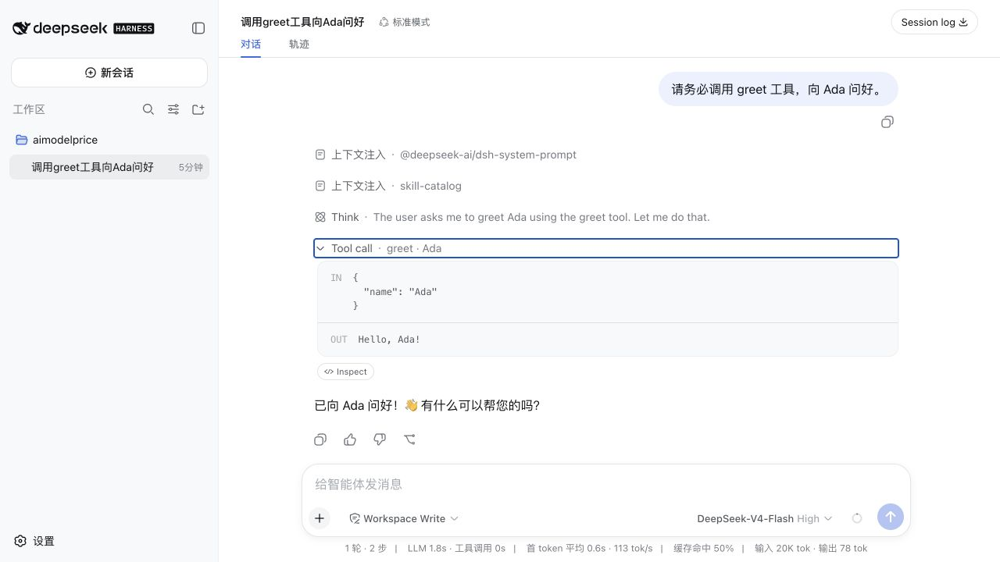

# dsh-plugin-greet

English | [简体中文](README.zh-CN.md)

An installable community plugin for DeepSeek Harness that demonstrates the complete lifecycle of a minimal tool plugin: bundle distribution, profile composition, tool registration, and a real tool call.

> This is a community example, not an official DeepSeek AI plugin. DeepSeek Harness is currently in Developer Preview, so future releases may require compatibility updates.



## Features

The plugin registers a `greet` tool with the model:

* Input: a required string named `name`
* Output: `Hello, <name>!`
* Additional dependencies: none
* Build step: none; the JavaScript in this repository can be installed directly

## Install from npm

Stop any running DeepSeek Harness instance, then install the pinned version into the `web` profile:

```sh
npx @deepseek-ai/dsh plugin --profile web add dsh-plugin-greet@0.1.0
```

Before starting, confirm that the bundle is present in the final configuration:

```sh
npx @deepseek-ai/dsh --profile web --dump-config
```

Then start the Web UI:

```sh
npx @deepseek-ai/dsh web
```

## Install from GitHub

Stop any running DeepSeek Harness instance, then install the pinned release into the `web` profile:

```sh
npx @deepseek-ai/dsh plugin --profile web add \
  github:0lidaxiang/dsh-plugin-greet#v0.1.0
```

Before starting, confirm that the bundle is present in the final configuration:

```sh
npx @deepseek-ai/dsh --profile web --dump-config
```

Start the Web UI:

```sh
npx @deepseek-ai/dsh web
```

Open <http://127.0.0.1:3080> and send this prompt to the model:

```text
You must use the greet tool to greet Ada.
```

Expand the tool call. The expected result is:

```text
IN  { "name": "Ada" }
OUT Hello, Ada!
```

The plugin does not listen for keywords such as `Hello`. It makes the `greet` tool available to the model, and the model decides whether to call it. Explicitly naming the tool, as in the example above, makes the behavior easier to verify.

## Install the development version

To try the latest code from `main`, install the branch directly:

```sh
npx @deepseek-ai/dsh plugin --profile web add \
  github:0lidaxiang/dsh-plugin-greet#main
```

For stable usage, pin a release tag or a specific commit SHA so that updates to the remote branch do not change the installed code unexpectedly.

## Install from a local checkout

Run this command from the parent directory of the repository:

```sh
npx @deepseek-ai/dsh plugin --profile web add ./dsh-plugin-greet
```

After changing the code, restart DeepSeek Harness and verify the tool through the chat interface.

## Uninstall

```sh
npx @deepseek-ai/dsh plugin --profile web remove dsh-plugin-greet
```

## Project structure

```text
dsh-plugin-greet/
├── package.json       # Declares the dsh.bundle entry
├── cordis.patch.yml   # Inserts the plugin into a profile
├── index.js           # Registers the greet tool
├── docs/              # README images
└── LICENSE
```

## Security and compatibility

DeepSeek Harness plugins run inside the host process. Review third-party plugin source code before installation, and prefer a pinned release tag or commit SHA.

This version was verified on August 14, 2026, with `@deepseek-ai/dsh 0.1.0-rc.6` using a real installation and tool call in the Web profile.

## License

[MIT](LICENSE)
