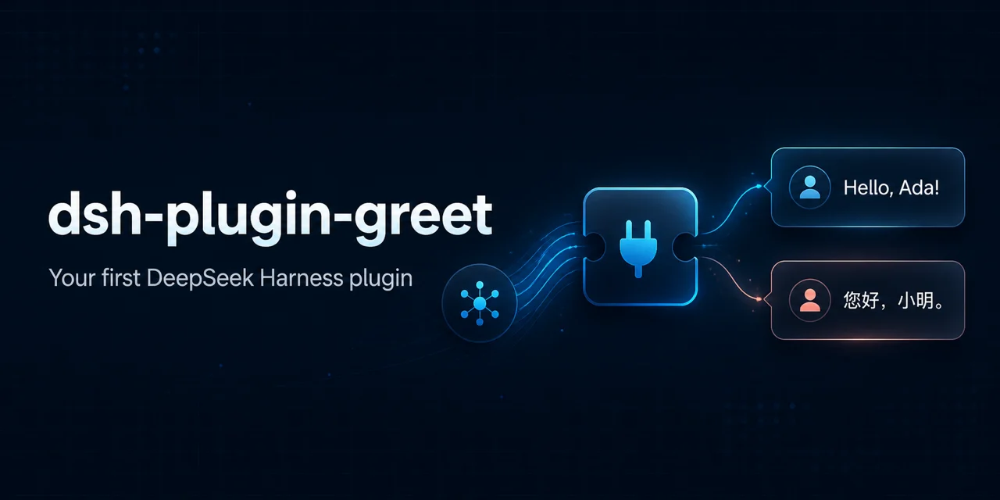
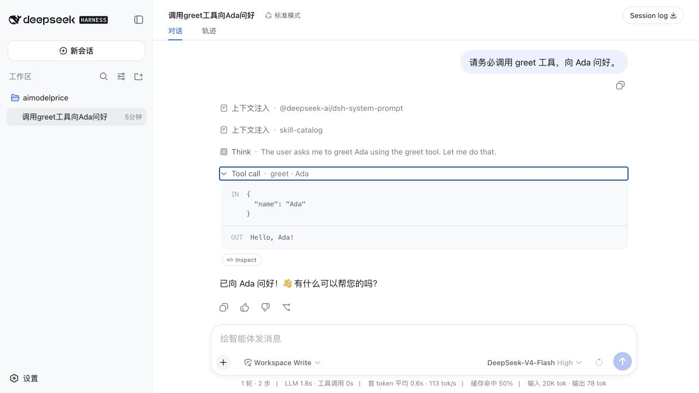

<p align="center">
  
</p>

# dsh-plugin-greet

[English](../README.md) | 简体中文

一个面向新手、可直接安装的 DeepSeek Harness 社区插件，用来演示 Bundle 分发、Profile 装配、插件配置、新版 `defineTool()` 接口、结构化输出、输入校验、自动测试和真实模型调用。

> 本项目是社区示例，不是 DeepSeek AI 官方插件。DeepSeek Harness 目前仍处于 Developer Preview，后续版本可能需要调整兼容性。



## 你能学到什么

项目把核心实现保留在一个小型入口文件中，让新手可以顺着完整链路阅读：

```text
用户提示词
  → 模型决定调用 greet 工具
  → 参数 Schema 检查数据结构
  → execute 校验并规范化参数
  → 工具返回结构化数据
  → output.render 生成模型可读文本
  → 模型组织最终回复
```

这个示例涵盖：

- 导出经过校验的插件 `Config`
- 注入并使用 Harness 的 `tools` 服务
- 使用新版 `defineTool()` Schema DSL 注册工具
- 必填和可选工具参数
- 中文和英文问候
- 友好和正式两种语气
- 结构化规范输出与文本渲染
- 清晰、可操作的参数错误
- 单元测试和 CI 打包检查

## 工具约定

插件向模型注册一个名为 `greet` 的工具。

### 输入

| 字段 | 必填 | 可选值 | 默认值 |
| --- | --- | --- | --- |
| `name` | 是 | 非空字符串，最多 80 个字符 | — |
| `language` | 否 | `en`、`zh` | 插件配置 |
| `style` | 否 | `friendly`、`formal` | 插件配置 |

插件会移除 `name` 开头和结尾的空白。未知参数、空名字、不支持的语言和不支持的语气都会返回明确错误。

### 输出

工具的规范结果是结构化数据：

```json
{
  "message": "Hello, Ada!",
  "name": "Ada",
  "language": "en",
  "style": "friendly"
}
```

`output.render` 会把这个结果转换成模型可读文本：

```text
Hello, Ada!
```

这样其他插件或策略可以使用结构化字段，同时不需要让模型读取原始 JSON。

## 问候示例

| 语言 | 语气 | 结果 |
| --- | --- | --- |
| 英文 | 友好 | `Hello, Ada!` |
| 英文 | 正式 | `Greetings, Ada.` |
| 中文 | 友好 | `你好，小明！` |
| 中文 | 正式 | `您好，小明。` |

## 支持的 dsh 版本

`dsh-plugin-greet@0.3.2` 推荐搭配 **`@deepseek-ai/dsh@0.2.0-rc.2`**。预览版 **`0.2.1-alpha.1`** 也已验证通过。兼容结论针对这两个精确版本，不代表所有 `0.2.x` 都已验证。

最近验证日期：**2026 年 10 月 7 日**。

| 已验证的插件版本 | dsh 版本 | 状态 |
| --- | --- | --- |
| `0.3.2` | `0.2.0-rc.2` | 支持；推荐安装版本；当前 CI 覆盖 |
| `0.3.2` | `0.2.1-alpha.1` | 支持的预览版；当前 CI 覆盖 |
| `0.3.0` / `0.3.1` | `0.1.2-rc.1` | 仅有历史验证；本次全新安装复查在 Web 启动时缺少 HMR 服务 |
| `0.3.0` / `0.3.1` | `0.1.5-alpha.1` | 仅有历史验证；本次全新安装复查出现上游 peer 依赖冲突 |
| `0.3.0` | `0.1.1-rc.1` | 仅有历史验证；未用插件 `0.3.2` 重新验证 |
| `0.1.x` | `0.1.0-rc.6` | 最初插件的目标版本；未用插件 `0.3.2` 重新验证 |
| 任意 | 其他 dsh 版本 | 未验证；使用前应运行兼容性检查 |

当前 CI 覆盖 Node.js 22.19 和 24，检查单元测试、通过 Profile CLI 安装插件打包产物、四种问候、非法参数、Web 启动、启动令牌登录和 HTML 响应，不包含真实模型请求。可查看 [0.3.2 的通过记录](https://github.com/0lidaxiang/dsh-plugin-greet/actions/runs/37595351660)。

旧 Harness 的宽松上游依赖范围如今可能解析出不兼容的服务。全新安装失败，不等于问候实现在已有旧环境中必然不兼容；本次未重新验证这些已有环境。新安装请使用上方两个明确支持的版本之一。

`@deepseek-ai/dsh-tools` 的 peer 声明保留了历史范围，供已有安装使用。满足该声明，不等于对应 dsh 已经过兼容验证。新的 Harness 版本需要重新运行兼容性检查，通过后再加入支持列表。

如需使用已验证的预览版，请把下方安装和启动命令中的 `@deepseek-ai/dsh@0.2.0-rc.2` 统一替换为 `@deepseek-ai/dsh@0.2.1-alpha.1`。

## 从 npm 安装

使用 Node.js `^22.19.0` 或 `>=24.0.0`，并安装 pnpm（`npm install -g pnpm@10.32.1`）以管理 Profile 插件。开发依赖以 Harness `0.2.0-rc.2` 为基准，CI 同时验证 `0.2.1-alpha.1`。以下命令固定使用本仓库已验证的默认发布版。

先停止正在运行的 DeepSeek Harness，然后把包装进 `web` Profile：

```sh
npx @deepseek-ai/dsh@0.2.0-rc.2 plugin --profile web add dsh-plugin-greet@0.3.2
```

`0.3.2` 针对 Harness 0.2 更新了开发依赖和兼容性检查，问候行为与 `0.3.0` 相同。

这条命令不只是普通的 `npm install`：它会把包装进指定的 Harness Profile，并把包声明的 Bundle 加入 Profile 组合配置。

启动前确认 Bundle 已进入最终配置：

```sh
npx @deepseek-ai/dsh@0.2.0-rc.2 --profile web --dump-config
```

然后启动 Web UI：

```sh
npx @deepseek-ai/dsh@0.2.0-rc.2 web
```

## 调用工具

使用启动命令自动打开的页面，或打开终端打印的完整地址，保留其中的 `?token=...` 参数。默认端口为 3080。首次访问会建立浏览器登录状态，然后跳转到不带参数的地址；没有有效登录状态时，直接打开裸地址会返回 401。随后发送：

```text
请务必调用 greet 工具，用友好的英文向 Ada 问好。
```

预期工具调用：

```text
IN  { "name": "Ada", "language": "en", "style": "friendly" }
OUT Hello, Ada!
```

再试试正式中文：

```text
请务必调用 greet 工具，用正式中文向小明问好。
```

预期结果：

```text
IN  { "name": "小明", "language": "zh", "style": "formal" }
OUT 您好，小明。
```

插件不会监听 `Hello` 等关键词。它只是让模型能够使用 `greet` 工具，是否调用由模型决定。明确指定 `greet` 工具，更容易稳定验证插件行为。

## 配置插件

导出的配置 Schema 提供以下默认值：

```yaml
greeting: Hello
punctuation: "!"
defaultLanguage: en
defaultStyle: friendly
```

如需覆盖默认值，可在更晚应用的 patch 层中重新声明插件行，例如 Profile 自己的 `cordis.patch.yml`：

```yaml
- insert:
    - id: greet-tool
      name: dsh-plugin-greet
      config:
        greeting: Hi
        punctuation: "!"
        defaultLanguage: en
        defaultStyle: friendly
```

使用这份配置后，只传入 `{ "name": "Grace" }` 会返回 `Hi, Grace!`。

`greeting` 和 `punctuation` 用于自定义友好英文输出；中文和正式措辞使用上表示例中的内置文本。模型省略参数时，插件才会使用 `defaultLanguage` 和 `defaultStyle`。

后应用的 patch 会替换整行配置，而不是深度合并单个字段。因此请把 `id`、`name` 和完整的 `config` 放在一起。

## 从 GitHub 安装

安装当前开发分支：

```sh
npx @deepseek-ai/dsh@0.2.0-rc.2 plugin --profile web add \
  github:0lidaxiang/dsh-plugin-greet#master
```

稳定使用建议选择已发布的 npm 版本、release tag 或具体 commit SHA。

## 本地开发安装

在仓库上一级目录执行：

```sh
npx @deepseek-ai/dsh@0.2.0-rc.2 plugin --profile web add ./dsh-plugin-greet
```

修改代码后重启 DeepSeek Harness，再通过聊天窗口验证工具调用。

## 开发与测试

安装依赖并运行单元测试：

```sh
npm ci
npm test
```

执行完整本地检查，包括 npm 发布包预览：

```sh
npm run check
```

测试会导入真实 Harness 工具接口，并覆盖配置默认值、工具注册信息、四种问候模式、结构化输出渲染、空白处理、非法值、未知参数和长度限制。GitHub Actions 会在 Node.js 22.19 和 24 上执行这些检查。

运行与 CI 相同的兼容性检查（需要 pnpm 和 npm registry 网络访问）：

```sh
npm run test:compat -- 0.2.0-rc.2
npm run test:compat -- 0.2.1-alpha.1
```

每次检查会在临时目录安装指定 Harness，使用该版本运行单元测试，再把当前代码打包，通过真实 Profile CLI 安装 tarball，并在本机回环地址的空闲端口启动 Web。检查覆盖四种问候、非法参数、启动令牌登录流程和 HTML 响应，结束后停止服务并删除临时 Profile。检查不会调用模型或使用你现有的 Profile。CI 会覆盖两个 Harness 版本与两个 Node 版本的全部组合。

升级 Harness 开发包时要同步更新 Cordis：`0.2.0-rc.2` 要求 `~4.0.4`，`0.2.1-alpha.1` 要求 `~4.0.5-alpha.1`。兼容性脚本会从官方 npm registry 读取所选版本的 Cordis peer 要求，不再复用开发环境中的固定版本。`dsh-tools` 和 `dsh-system-prompt` 应固定为匹配版本；`dsh-tools` 的 npm `latest` 标签并不跟随 CLI 的 `latest` 标签。

## 常见问题

### 模型回复了，但没有调用 `greet`

请明确发送“请务必调用 greet 工具……”。普通的 `Hello` 或“你好”不会强制触发工具。

### 工具列表中找不到 `greet`

停止正在运行的 Harness，重新安装到同一个 Profile，使用 `--dump-config` 检查配置，然后重启 Web UI。

### `npm install dsh-plugin-greet` 成功了，但工具仍然不存在

普通 npm 安装只会把依赖加入当前 Node.js 项目。请使用 `dsh plugin --profile <name> add ...` 把 Bundle 安装并装配进 Harness Profile。

### Web 页面返回 401

打开当前 Harness 进程在终端打印的完整启动地址，保留 `?token=...` 参数以建立浏览器登录状态。旧进程的令牌，或没有有效登录状态时使用的裸地址，都无法完成登录。

### 安装时提示缺少 Harness peer 依赖

官方 Profile 关闭了自动安装 peer 依赖，在启动时从宿主解析 Harness 服务，因此 pnpm 在安装阶段可能提示缺少 peer。确认使用下方列出的兼容版本，检查 `--dump-config`，再重启 Harness。不要为了消除警告而给 Profile 单独安装一份 `dsh-tools`，插件应使用宿主的服务。

### 修改配置后没有生效

确认后应用的 patch 使用相同的 `id`（`greet-tool`），并同时写出包 `name` 和完整 `config`。

### Harness 源码仓库在 `git pull` 后无法启动

切换到支持的 Node.js 版本，刷新依赖，清理旧生成产物后再构建：

```sh
nvm use 22.22.3
pnpm install --frozen-lockfile
pnpm run clean
pnpm run build
pnpm dsh --profile web --no-open
```

## 文件结构

```text
dsh-plugin-greet/
├── .github/
│   ├── assets/social-preview.png # GitHub 社交预览图
│   └── workflows/ci.yml          # 自动测试与打包检查
├── docs/
│   ├── README.zh-CN.md       # 中文文档
│   ├── greet-tool-result.png # README 截图
│   └── readme-hero.webp      # 轻量 README 横幅
├── scripts/check-compat.mjs # 发布包安装与 Web 兼容性检查
├── scripts/fixtures/        # 临时 Web Profile 使用的工具运行时探针
├── tests/greet.test.js       # Node.js 单元测试
├── cordis.patch.yml          # 把插件插入 Profile
├── index.js                  # Config 与 greet 工具实现
├── package-lock.json         # 可复现的依赖版本
├── package.json              # npm 包与 dsh.bundle 信息
└── LICENSE
```

## 安全与兼容性

DeepSeek Harness 插件运行在宿主进程中。安装第三方插件前请检查源码，并优先固定 release tag 或 commit SHA。

插件不访问网络、文件系统、Shell 或凭据。它使用 DeepSeek AI 官方的 `@deepseek-ai/dsh-tools` 注册类型化工具，并使用 `@deepseek-ai/schemastery` 完成配置校验。

当前支持范围、历史验证记录及已知安装限制，见上方[支持的 dsh 版本](#支持的-dsh-版本)。

## License

[MIT](../LICENSE)
